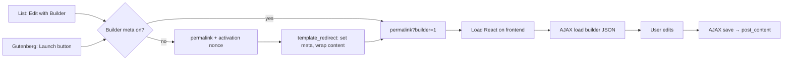
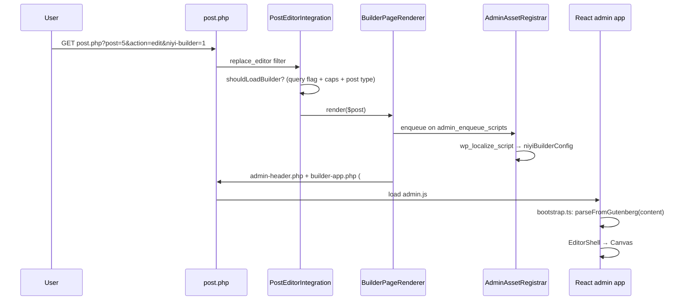

# Editor integration — Other Editors & Niyi Builder

Shared notes for **humans and AI**: how **other visual page editors** typically load in WordPress (reference only), how Niyi Builder does it today, and where to change things next.

**Related docs**

- [LAYOUT_SCHEMA_V0.md](./LAYOUT_SCHEMA_V0.md) — JSON document shape
- [EXECUTION_PLAN.md](./EXECUTION_PLAN.md) — phase/milestone plan
- `.cursor/rules/wordpress-editor-integration.mdc` — short AI guardrails

---

## 1. Big picture

Visual page builders answer: _“How does a user open a visual builder for one post/page?”_

|                        | **Other Editors (common pattern)**                  | **Niyi Builder (today)**                          |
| ---------------------- | --------------------------------------------------- | ------------------------------------------------- |
| Where editor runs      | Often **frontend** — public page URL                | **wp-admin** — `post.php` screen                  |
| Stored content         | Often shortcodes or custom markup in `post_content` | **Gutenberg block markup** in `post_content`      |
| Replaces block editor? | Often **no** — coexists; links out to builder       | **Yes** — `replace_editor` when `?niyi-builder=1` |
| Save transport         | Often `admin-ajax.php`                              | **REST** (planned, issue #18)                     |

We borrowed a common **entry-point pattern** from other editors (row action + Gutenberg launch button). We did **not** copy frontend editing or non-Gutenberg storage — that would fight our Gutenberg-first goal.

---

## 2. How other editors typically work (reference)

> Patterns observed across frontend-first visual builders. Do not copy third-party code into this plugin. Use this section when comparing approaches.

### 2.1 Two editing surfaces (common)

Many other editors offer **two** surfaces:

1. **Frontend visual builder** — primary React app on the **live permalink**
2. **Backend builder** — legacy overlay on the **classic** admin editor; often **disabled when Gutenberg is active**

### 2.2 Frontend builder trigger flow (typical)



**Typical mechanisms**

| Mechanism               | Role                                                    |
| ----------------------- | ------------------------------------------------------- |
| Query flag on permalink | Builder active on frontend view                         |
| Activation nonce        | First-time: enable builder meta, wrap content, redirect |
| New-post nonce          | Save auto-draft, redirect to permalink with builder     |

**Post meta (typical)**

- A `_uses_builder` (or similar) flag — “this page was built with the visual editor”

### 2.3 Typical hooks (other editors)

| What             | Hook / mechanism                                                 |
| ---------------- | ---------------------------------------------------------------- |
| Bootstrap        | `init` — load builder framework                                  |
| Frontend gate    | Custom action/filter — load builder only when query flag present |
| React mount      | `the_content` — inject app root element                          |
| Frontend assets  | `wp_enqueue_scripts`, `wp_footer`                                |
| Gutenberg bridge | `enqueue_block_editor_assets`                                    |
| Row action       | `post_row_actions`, `page_row_actions`                           |
| Load content     | `wp_ajax_*` retrieve builder data                                |
| Save             | `wp_ajax_*` save builder data                                    |
| JS config        | `wp_localize_script` — post ID, nonces, URLs                     |

**Often not used:** `replace_editor` — many other editors coexist with Gutenberg and link out instead.

### 2.4 Gutenberg coexistence (typical)

On the block editor screen, other editors commonly:

- Enqueue a small Gutenberg compatibility bundle
- Pass a `builderUrl` (permalink + query flag) and `builderUsed` via `wp_localize_script`
- Show a “Launch visual builder” control — user leaves Gutenberg for the builder

That **launch link out** pattern is what we mirrored in `assets/gutenberg-bridge.js`.

---

## 3. How Niyi Builder works (current code)

### 3.1 Boot chain

```
niyi-builder.php
  → includes/Plugin.php::boot()
      → PostEditorIntegration::register()   ← post/page edit (primary)
      → BuilderAdminPage::register()        ← dev menu only
```

### 3.2 Opening the builder (three entry points)

| Entry                | User action                                                                | Resulting URL                                   |
| -------------------- | -------------------------------------------------------------------------- | ----------------------------------------------- |
| **Row action**       | Posts/Pages list → “Edit with Niyi Builder”                                | `post.php?post={id}&action=edit&niyi-builder=1` |
| **Gutenberg button** | Block editor sidebar (Document panel) or header → “Edit with Niyi Builder” | same                                            |

**Important:** `action=edit` is required — WordPress only calls `replace_editor` inside the `edit` case of `post.php`. `PostEditorIntegration::preparePostEditScreen()` forces this when `niyi-builder=1` is present.
| **Dev menu** | Admin → “Niyi Builder (Dev)” | `admin.php?page=niyi-builder` (no post) |

URL builder: `PostEditorIntegration::getBuilderEditUrl()`.

### 3.3 Request flow (post edit)



**Critical WordPress detail:** when `replace_editor` returns `true`, core **skips** `edit-form-blocks.php`. Our `BuilderPageRenderer` must output the full screen itself (`admin-header.php` + view). Core then loads `admin-footer.php`.

### 3.4 File map (where to edit what)

| Concern                                    | File                                       |
| ------------------------------------------ | ------------------------------------------ |
| Hooks, row actions, Gutenberg bridge       | `includes/Admin/PostEditorIntegration.php` |
| Full-screen shell render                   | `includes/Admin/BuilderPageRenderer.php`   |
| Script/style enqueue + `niyiBuilderConfig` | `includes/Admin/AdminAssetRegistrar.php`   |
| Dev-only admin menu                        | `includes/Admin/BuilderAdminPage.php`      |
| HTML mount point                           | `resources/views/builder-app.php`          |
| Block editor launch button                 | `assets/gutenberg-bridge.js`, `.css`       |
| Full-screen admin CSS                      | `assets/admin.css`                         |
| React entry                                | `admin/src/main.tsx`                       |
| Load post content into store               | `admin/src/bootstrap.ts`                   |
| Canvas UI                                  | `packages/editor/src/components/*`         |
| Document state                             | `packages/editor/src/store.ts`             |
| Gutenberg ↔ JSON                           | `packages/serializer/`                     |

### 3.5 PHP → JavaScript bootstrap

`AdminAssetRegistrar` passes `window.niyiBuilderConfig`:

```json
{
  "postId": 5,
  "postType": "page",
  "postTitle": "About",
  "restUrl": "https://site.test/wp-json/wp/v2/",
  "nonce": "...",
  "content": "<!-- wp:group -->...",
  "exitUrl": "post.php?post=5&action=edit",
  "isDevShell": false
}
```

`admin/src/bootstrap.ts` runs **before** React mount:

1. Read `niyiBuilderConfig.content`
2. `parseFromGutenberg(content)` → `BuilderDocument`
3. `useEditorStore.setDocument(...)`

If content is empty, store keeps `createEmptyDocument()`.

### 3.6 Data model reminder

```
post_content (DB)     ← canonical, Gutenberg block comments
       ↕ serializer
BuilderDocument (JSON) ← editing only, in Zustand
       ↕
React canvas preview
```

**Never** save `BuilderDocument` JSON to the database. See `.cursor/rules/project-principles.mdc`.

### 3.7 Supported post types (today)

`post` and `page` only — see `PostEditorIntegration::SUPPORTED_POST_TYPES`.

To add e.g. `portfolio`: extend that list and confirm REST route (`wp/v2/portfolio` or custom).

---

## 4. Other Editors vs Niyi — what we took vs what we skipped

| Idea                             | Other Editors (typical) | Niyi                         |
| -------------------------------- | ----------------------- | ---------------------------- |
| Row action “Edit with …”         | ✅                      | ✅ `addRowAction()`          |
| Gutenberg launch button          | ✅                      | ✅ `gutenberg-bridge.js`     |
| Frontend visual editing          | ✅ primary              | ❌ admin full-screen instead |
| `replace_editor`                 | ❌                      | ✅                           |
| Shortcodes / custom markup in DB | ✅                      | ❌ core blocks only          |
| `admin-ajax` save                | ✅                      | ❌ REST planned              |
| Post meta “uses builder”         | ✅                      | ❌ not yet (optional later)  |

---

## 5. Local development workflow

```bash
# From repo root
npm run dev          # Vite on :5173 — enable in config/plugin.php:
                     #   assets.vite_dev.enabled = true

npm run build        # Production bundles → build/ (also run automatically by release scripts)
npm run release:dev  # Build + deploy copy to wp-content/plugins/niyi-builder (replaces symlink)
npm test             # Serializer + core tests
```

**Try the builder**

1. Deploy/sync plugin to WordPress.
2. Edit a page in wp-admin.
3. Click **Edit with Niyi Builder** (header or list row).
4. Toolbar shows post title + **Block editor** link (`exitUrl`).

---

## 6. How to continue without AI (checklist)

### Add REST save (issue #18)

1. In `packages/editor` or `admin/src`, add `savePost()`:
   - `serializeToGutenberg(document)` from `@niyi-builder/serializer`
   - `fetch(\`${restUrl}pages/${postId}\`, { method: 'PUT', headers: { 'X-WP-Nonce': nonce, 'Content-Type': 'application/json' }, body: JSON.stringify({ content }) })`
2. Wire Toolbar **Save** button to that function.
3. Use `postType` to pick `posts` vs `pages` endpoint.

### Add block rendering on canvas (issue #14–15)

1. Register block components in `packages/blocks`.
2. Walk `document.root` in `Canvas.tsx` and render by `node.type`.

### Add “default to builder” for a post (meta flag pattern)

1. On first builder save, `update_post_meta($id, '_niyi_builder', '1')`.
2. Filter `redirect_post_location` or edit links to append `niyi-builder=1` when meta is set.

### New post flow (auto-draft redirect pattern)

1. Hook `load-post-new.php` or `wp_insert_post` on auto-draft.
2. After draft exists, redirect to `getBuilderEditUrl($post_id)`.

---

## 7. Open TODOs

| Item                         | Issue  | Status           |
| ---------------------------- | ------ | ---------------- |
| Component registry           | #14    | Not started      |
| Canvas rendering             | #15    | Placeholder text |
| Selection / inserter         | #16–17 | Buttons disabled |
| REST save                    | #18    | Not started      |
| New post → builder redirect  | —      | Not started      |
| Post meta “edited with Niyi” | —      | Optional         |

---

## 8. Glossary

| Term                  | Meaning                                                                      |
| --------------------- | ---------------------------------------------------------------------------- |
| **Frontend builder**  | Visual editor loaded on the public permalink (common in other editors)       |
| **Backend builder**   | Visual editor overlay on classic admin (often disabled when Gutenberg is on) |
| **BuilderDocument**   | Our internal JSON tree (`version` + `root`)                                  |
| **Serializer**        | `packages/serializer` — JSON ↔ Gutenberg markup                              |
| **replace_editor**    | WP filter; return `true` to skip block/classic editor                        |
| **niyiBuilderConfig** | PHP → JS bootstrap object on builder screens                                 |

---

_Last updated: 2026-06-08 — reflects post edit integration (PostEditorIntegration)._
