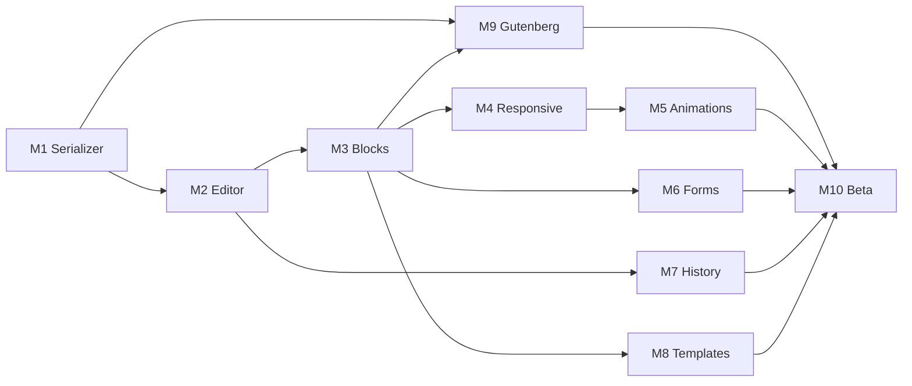

# Niyi Builder — Execution Plan

> **Status:** Phase 1 Complete. Phase 2 (Core Editor) in progress.
> **Source:** [Open Visual Gutenberg Builder.pdf](../Open%20Visual%20Gutenberg%20Builder.pdf)
> **Repo:** [harish282/niyi-builder](https://github.com/harish282/niyi-builder)
> **Issue map:** [scripts/github-issue-map.json](../scripts/github-issue-map.json) (draft ID → GitHub #)

---

## Table of Contents

1. [Vision & Goals](#vision--goals)
2. [Technology & Repository Layout](#technology--repository-layout)
3. [MVP Scope (v1.0)](#mvp-scope-v10)
4. [Timeline Overview](#timeline-overview)
5. [Phases, Sprints & Tasks](#phases-sprints--tasks)
6. [GitHub Milestones (Proposed)](#github-milestones-proposed)
7. [GitHub Labels (Proposed)](#github-labels-proposed)
8. [GitHub Issues (Draft)](#github-issues-draft)
9. [Future Roadmap (Post v1.0)](#future-roadmap-post-v10)
10. [v1.0 Success Metrics](#v10-success-metrics)
11. [Open Questions for Discussion](#open-questions-for-discussion)

---

## Vision & Goals

**Working title:** Open Visual Gutenberg Builder (Niyi Builder)

Build an open-source visual WordPress page builder that feels like other visual editors but stores **native Gutenberg blocks** — no shortcode lock-in, lightweight frontend, responsive by default, developer-friendly and extensible.

| Principle               | Meaning                             |
| ----------------------- | ----------------------------------- |
| Open source             | GPL, community-driven               |
| Native Gutenberg output | Real blocks in post content         |
| No vendor lock-in       | Deactivate plugin → content remains |
| Lightweight frontend    | Minimal CSS/JS on public pages      |
| Modern visual editing   | Canvas, DnD, responsive controls    |
| Developer friendly      | Extensible packages, clear APIs     |

**Product goal:** Elementor-style visual editing with Gutenberg-native storage so users own their content.

---

## Technology & Repository Layout

| Layer     | Stack                                           |
| --------- | ----------------------------------------------- |
| Frontend  | React, TypeScript, dnd-kit, Zustand             |
| WordPress | Gutenberg APIs, Block Editor, `@wordpress/data` |
| Build     | Vite, TypeScript, ESLint, Prettier              |

**Target repository structure (WordPress plugin + TS packages):**

```
niyi-builder/                   # wp-content/plugins/niyi-builder/
├── niyi-builder.php            # Plugin bootstrap
├── config/                     # plugin.php settings
├── includes/                   # PHP (NiyiBuilder\)
├── resources/views/            # Admin templates
├── admin/                      # Visual editor (React, Vite)
├── assets/                     # Static plugin assets
├── build/                      # Vite production output
├── blocks/                     # Gutenberg block.json + PHP renderers
├── languages/
├── packages/                   # TypeScript monorepo
│   ├── editor/                 # Visual canvas & UI
│   ├── serializer/             # JSON ↔ Gutenberg
│   ├── blocks/                 # Block schemas & editor components
│   ├── animations/
│   ├── forms/
│   ├── history/                # Undo/redo
│   └── core/                   # Shared types, utils
├── docs/
├── examples/
└── website/
```

---

## MVP Scope (v1.0)

### Layout blocks

- **Container** — width, max-width, padding, margin, background, border-radius
- **Grid** — columns, rows, gap, responsive layout
- **Spacer** — adjustable height

### Content blocks

- **Heading** — H1–H6, typography
- **Text** — rich text
- **Button** — text, link, styles
- **Image** — media library
- **Icon** — SVG
- **Video** — YouTube, Vimeo, self-hosted

### Form builder

- Fields: name, text, email, phone, number, textarea, select, checkbox, radio, submit
- Actions: email notification, database storage
- _(Future: Mailchimp, Brevo, HubSpot)_

### Responsive

- Breakpoints: desktop, tablet, mobile
- Properties: width, margin, padding, typography, visibility

### Animations

- Entrance: fade in/up/down/left/right, zoom in/out
- Controls: duration, delay, offset
- Markup pattern: `data-animation`, `data-duration`, etc.

### Templates

- Starter pages: landing (SaaS, agency, portfolio)
- Sections: hero, features, testimonials, pricing, CTA, contact

---

## Timeline Overview

| Phase | Name                    | Duration | Sprints    | Cumulative          |
| ----- | ----------------------- | -------- | ---------- | ------------------- |
| 1     | Architecture validation | 2 weeks  | Sprint 0   | 2 wk                |
| 2     | Core editor             | 4 weeks  | Sprint 1–2 | 6 wk                |
| 3     | Core blocks             | 4 weeks  | Sprint 3–4 | 10 wk               |
| 4     | Responsive design       | 2 weeks  | Sprint 5   | 12 wk               |
| 5     | Animations              | 2 weeks  | Sprint 6   | 14 wk               |
| 6     | Forms                   | 3 weeks  | Sprint 7   | 17 wk               |
| 7     | Productivity            | 3 weeks  | Sprint 8   | 20 wk               |
| 8     | Templates               | 2 weeks  | Sprint 9   | 22 wk               |
| 9     | Gutenberg integration   | 3 weeks  | Sprint 10  | 25 wk               |
| 10    | Public beta             | 2 weeks  | Sprint 11  | **27 wk (~6.5 mo)** |

_Durations are from the spec; calendar dates should be set when work starts._

---

## Phases, Sprints & Tasks

### Phase 1 — Architecture Validation (2 weeks)

**Milestone:** `M1: Architecture Validated` (COMPLETED)
**Success criteria:** JSON → Gutenberg → JSON round-trip with **no data loss** (including nested containers/blocks).

#### Sprint 0 — Serializer proof of concept

| #    | Task                                   | Notes                                                 |
| ---- | -------------------------------------- | ----------------------------------------------------- |
| 0.1  | Monorepo & package scaffolding         | Done                                                  |
| 0.2  | WordPress plugin scaffold              | Done                                                  |
| 0.3  | React + TypeScript + Vite in `admin/`  | Done                                                  |
| 0.4  | ESLint + Prettier + CI lint job (stub) | Done                                                  |
| 0.5  | Layout JSON schema (v0)                | Done                                                  |
| 0.6  | JSON → Gutenberg conversion            | Done                                                  |
| 0.7  | Gutenberg → JSON conversion            | Done                                                  |
| 0.8  | Round-trip tests                       | Done                                                  |
| 0.9  | Nested container validation            | Done                                                  |
| 0.10 | Nested block validation                | Done                                                  |

**Deliverable:** Serializer package with passing round-trip tests; minimal admin entry to trigger test page (optional).

---

### Phase 2 — Core Editor (4 weeks)

**Milestone:** `M2: Visual Editor Shell`

#### Sprint 1 — Canvas foundation (2 weeks)

| #   | Task                         | Notes                                     |
| --- | ---------------------------- | ----------------------------------------- |
| 1.1 | Editor shell UI              | Done (`EditorShell.tsx`)                  |
| 1.2 | Component registry           | Register block types for canvas           |
| 1.3 | Rendering engine             | JSON tree → React preview                 |
| 1.4 | Selection system             | Click to select, highlight, breadcrumb    |
| 1.5 | Add element flow             | Insert from palette (stub blocks OK)      |
| 1.6 | Wire serializer to save/load | Done (Issue #18 - REST API wired)         |

**Deliverable:** User can add and select elements on canvas.

#### Sprint 2 — Drag and drop (2 weeks)

| #   | Task                            | Notes                             |
| --- | ------------------------------- | --------------------------------- |
| 2.1 | dnd-kit integration             | Drag handles, sensors             |
| 2.2 | Reordering siblings             | Within parent                     |
| 2.3 | Nesting drops                   | Drop into container/grid          |
| 2.4 | Drop indicators                 | Visual affordances (lines, zones) |
| 2.5 | Keyboard accessibility baseline | Focus order, escape cancel        |

**Deliverable:** Elementor-style drag-and-drop on canvas.

---

### Phase 3 — Core Blocks (4 weeks)

**Milestone:** `M3: MVP Block Library`

#### Sprint 3 — Layout blocks (2 weeks)

| #   | Task                                 | Notes                                         |
| --- | ------------------------------------ | --------------------------------------------- |
| 3.1 | Container block — model + serializer | Attributes map to Gutenberg                   |
| 3.2 | Container — inspector controls       | Width, max-width, padding, margin, bg, radius |
| 3.3 | Grid block — model + serializer      | Columns, rows, gap                            |
| 3.4 | Grid — inspector + responsive hooks  | Prep for Phase 4                              |
| 3.5 | Spacer block                         | Height control                                |
| 3.6 | Frontend render (PHP or block.json)  | Lightweight public CSS                        |

#### Sprint 4 — Content blocks (2 weeks)

| #   | Task                         | Notes                                     |
| --- | ---------------------------- | ----------------------------------------- |
| 4.1 | Heading block                | H1–H6, typography controls                |
| 4.2 | Text block                   | Rich text (TinyMCE or block editor field) |
| 4.3 | Button block                 | Text, link, style variants                |
| 4.4 | Image block                  | Media library picker                      |
| 4.5 | Icon block                   | SVG picker/upload                         |
| 4.6 | Video block                  | YouTube, Vimeo, self-hosted               |
| 4.7 | End-to-end landing page demo | Internal example in `examples/`           |

**Deliverable:** Build complete landing pages in the visual editor.

---

### Phase 4 — Responsive Design (2 weeks)

**Milestone:** `M4: Responsive Editing`

#### Sprint 5 — Breakpoints & preview (2 weeks)

| #   | Task                                    | Notes                                          |
| --- | --------------------------------------- | ---------------------------------------------- |
| 5.1 | Breakpoint system                       | Desktop / tablet / mobile tokens               |
| 5.2 | Device switcher UI                      | Toolbar control                                |
| 5.3 | Responsive attribute storage            | Per-breakpoint overrides in JSON               |
| 5.4 | Inspector responsive controls           | Width, margin, padding, typography, visibility |
| 5.5 | Canvas preview mode                     | Constrained width per device                   |
| 5.6 | Serializer support for responsive attrs | Round-trip per breakpoint                      |

**Deliverable:** Edit separately for desktop, tablet, mobile.

---

### Phase 5 — Animations (2 weeks)

**Milestone:** `M5: Animation Engine`

#### Sprint 6 — Entrance animations (2 weeks)

| #   | Task                                     | Notes                                                   |
| --- | ---------------------------------------- | ------------------------------------------------------- |
| 6.1 | Animation engine package                 | `packages/animations`                                   |
| 6.2 | Data attributes on blocks                | `data-animation`, `data-duration`, `data-delay`, offset |
| 6.3 | Fade effects                             | in, up, down, left, right                               |
| 6.4 | Zoom effects                             | in, out                                                 |
| 6.5 | Inspector: duration, delay, offset       |                                                         |
| 6.6 | Frontend JS (intersection observer)      | Respect `prefers-reduced-motion`                        |
| 6.7 | Serializer round-trip for animation meta |                                                         |

**Deliverable:** Modern interactive pages without heavy animation libraries.

---

### Phase 6 — Forms (3 weeks)

**Milestone:** `M6: Form Builder`

#### Sprint 7 — Form block & submissions (3 weeks)

| #   | Task                                  | Notes                                                               |
| --- | ------------------------------------- | ------------------------------------------------------------------- |
| 7.1 | Form block container                  | Drop targets for fields                                             |
| 7.2 | Field blocks                          | name, text, email, phone, number, textarea, select, checkbox, radio |
| 7.3 | Submit button + validation rules      | Client-side basics                                                  |
| 7.4 | Submission handler (REST)             | Nonce, capability checks                                            |
| 7.5 | Database storage                      | Custom table or CPT for entries                                     |
| 7.6 | Email notifications                   | `wp_mail` + configurable recipient                                  |
| 7.7 | Spam protection hook                  | Honeypot or integrate Akismet later                                 |
| 7.8 | Gutenberg serialization for form tree |                                                                     |

**Deliverable:** Working contact forms with email + DB storage.

---

### Phase 7 — Productivity Features (3 weeks)

**Milestone:** `M7: Production Editing Workflow`

#### Sprint 8 — History & clipboard (3 weeks)

| #   | Task                                 | Notes                                |
| --- | ------------------------------------ | ------------------------------------ |
| 8.1 | History package (`packages/history`) | Command pattern                      |
| 8.2 | Undo / redo                          | Keyboard shortcuts                   |
| 8.3 | Duplicate element                    |                                      |
| 8.4 | Copy / paste                         | Within page; define cross-page scope |
| 8.5 | Delete with confirmation optional    |                                      |
| 8.6 | Zustand store integration            | Single source of truth               |

**Deliverable:** Production-ready editing workflow.

---

### Phase 8 — Templates (2 weeks)

**Milestone:** `M8: Template Library`

#### Sprint 9 — Import/export & starters (2 weeks)

| #   | Task                          | Notes                                               |
| --- | ----------------------------- | --------------------------------------------------- |
| 9.1 | Template export format        | JSON + assets manifest                              |
| 9.2 | Template import               | Replace or append sections                          |
| 9.3 | In-editor template library UI | Categories: landing, sections                       |
| 9.4 | Starter: SaaS landing         |                                                     |
| 9.5 | Starter: Agency landing       |                                                     |
| 9.6 | Starter: Portfolio landing    |                                                     |
| 9.7 | Section library               | Hero, features, testimonials, pricing, CTA, contact |

**Deliverable:** Fast page creation from templates.

---

### Phase 9 — Gutenberg Integration (3 weeks)

**Milestone:** `M9: Full Gutenberg Compatibility`

#### Sprint 10 — Interop & validation (3 weeks)

| #    | Task                            | Notes                                       |
| ---- | ------------------------------- | ------------------------------------------- |
| 10.1 | Import existing Gutenberg pages | Parse core blocks into JSON                 |
| 10.2 | Edit existing pages             | Open post in visual builder                 |
| 10.3 | Export native Gutenberg blocks  | Save produces valid block markup            |
| 10.4 | Compatibility matrix            | core/group, columns, paragraph, image, etc. |
| 10.5 | Validation test suite           | E2E or integration tests                    |
| 10.6 | Conflict handling               | Unsupported blocks → graceful fallback      |

**Deliverable:** Seamless coexistence with block editor.

---

### Phase 10 — Public Beta (2 weeks)

**Milestone:** `M10: Public Beta (v1.0.0-beta)`
**Tag:** `v1.0.0-beta.1` → `v1.0.0`

#### Sprint 11 — Release prep (2 weeks)

| #    | Task                          | Notes                                       |
| ---- | ----------------------------- | ------------------------------------------- |
| 11.1 | User documentation            | `docs/` — install, blocks, forms, templates |
| 11.2 | Marketing / project website   | `website/` — can be GitHub Pages            |
| 11.3 | Demo site                     | Hosted WP with sample pages                 |
| 11.4 | GitHub Actions                | Build, test, lint, release artifact         |
| 11.5 | Plugin packaging              | Zip for WP install                          |
| 11.6 | WordPress.org submission prep | Readme.txt, assets, review checklist        |
| 11.7 | Performance audit             | Lighthouse > 90 target                      |
| 11.8 | Security review               | Capabilities, sanitization, escaping        |

**Deliverable:** Public beta release.

---

## GitHub Milestones (Proposed)

Create **10 milestones** on [harish282/niyi-builder](https://github.com/harish282/niyi-builder). Suggested due dates are offsets from **project start** — replace `T0` with your kickoff date.

| ID  | Milestone title              | Target        | Issues (count) |
| --- | ---------------------------- | ------------- | -------------- |
| M1  | Architecture Validated       | T0 + 2 weeks  | 10             |
| M2  | Visual Editor Shell          | T0 + 6 weeks  | 11             |
| M3  | MVP Block Library            | T0 + 10 weeks | 13             |
| M4  | Responsive Editing           | T0 + 12 weeks | 6              |
| M5  | Animation Engine             | T0 + 14 weeks | 7              |
| M6  | Form Builder                 | T0 + 17 weeks | 8              |
| M7  | Production Editing Workflow  | T0 + 20 weeks | 6              |
| M8  | Template Library             | T0 + 22 weeks | 7              |
| M9  | Full Gutenberg Compatibility | T0 + 25 weeks | 6              |
| M10 | Public Beta (v1.0)           | T0 + 27 weeks | 8              |

**Optional meta-milestone:** `v1.0.0` (close M10 + tag release).

---

## GitHub Labels (Proposed)

| Label                    | Color (suggested) | Use                    |
| ------------------------ | ----------------- | ---------------------- |
| `epic`                   | `#7057ff`         | Large feature grouping |
| `phase-1` … `phase-10`   | neutral           | Filter by phase        |
| `sprint-0` … `sprint-11` | neutral           | Filter by sprint       |
| `type:feature`           | `#0e8a16`         | New capability         |
| `type:task`              | `#fbca04`         | Implementation work    |
| `type:test`              | `#1d76db`         | Tests only             |
| `type:docs`              | `#0075ca`         | Documentation          |
| `type:infra`             | `#5319e7`         | CI, tooling, repo      |
| `package:serializer`     |                   | Area                   |
| `package:editor`         |                   | Area                   |
| `package:blocks`         |                   | Area                   |
| `package:animations`     |                   | Area                   |
| `package:forms`          |                   | Area                   |
| `package:history`        |                   | Area                   |
| `package:core`           |                   | Area                   |
| `priority:P0`            | `#b60205`         | Blocker                |
| `priority:P1`            | `#d93f0b`         | High                   |
| `priority:P2`            | `#fef2c0`         | Normal                 |
| `good first issue`       | `#7057ff`         | Onboarding             |
| `blocked`                | `#000000`         | Waiting on dependency  |

---

## GitHub Issues (Draft)

Below are **82 draft issues**. Each maps to one task above. Copy/adjust before creating on GitHub.
**Format:** `#[draft-id]` Title — Milestone — Labels — Description stub.

---

### Phase 1 / Sprint 0 (M1)

| Draft ID | Title                                                | Labels                                                           | Depends on |
| -------- | ---------------------------------------------------- | ---------------------------------------------------------------- | ---------- |
| #1       | [Epic] Phase 1: Architecture validation              | epic, phase-1, sprint-0                                          | —          |
| #2       | Scaffold monorepo and `packages/*` workspaces        | type:infra, phase-1, sprint-0, priority:P0                       | —          |
| #3       | Create WordPress plugin scaffold (`plugin/php`)      | type:feature, phase-1, sprint-0, priority:P0                     | #2         |
| #4       | Configure React + TypeScript + Vite for plugin admin | type:infra, phase-1, sprint-0, priority:P0                       | #3         |
| #5       | Add ESLint, Prettier, and editor TS config           | type:infra, phase-1, sprint-0                                    | #4         |
| #6       | Define layout JSON schema v0                         | type:docs, package:serializer, phase-1, sprint-0, priority:P0    | #2         |
| #7       | Implement JSON → Gutenberg block serialization       | type:feature, package:serializer, phase-1, sprint-0, priority:P0 | #6         |
| #8       | Implement Gutenberg → JSON deserialization           | type:feature, package:serializer, phase-1, sprint-0, priority:P0 | #6         |
| #9       | Add round-trip unit tests (flat block tree)          | type:test, package:serializer, phase-1, sprint-0                 | #7, #8     |
| #10      | Validate nested containers in round-trip tests       | type:test, package:serializer, phase-1, sprint-0                 | #9         |
| #11      | Validate nested content blocks in round-trip tests   | type:test, package:serializer, phase-1, sprint-0                 | #10        |

**Issue #2 body (example):**

```markdown
## Summary

Set up monorepo root with workspace tooling and empty packages: `core`, `serializer`, `editor`, `blocks`, `animations`, `forms`, `history`.

## Acceptance criteria

- [ ] Root `package.json` with workspaces
- [ ] Shared TS config extended by packages
- [ ] `packages/core` exports shared types (placeholder OK)

## References

- docs/EXECUTION_PLAN.md — Phase 1
```

---

### Phase 2 / Sprint 1 (M2)

| Draft ID | Title                                                    | Labels                                                                           | Depends on |
| -------- | -------------------------------------------------------- | -------------------------------------------------------------------------------- | ---------- |
| #12      | [Epic] Phase 2: Core editor                              | epic, phase-2                                                                    | M1         |
| #13      | Build visual editor shell (layout, toolbar placeholders) | type:feature, package:editor, phase-2, sprint-1, priority:P0                     | M1         |
| #14      | Implement component registry for canvas blocks           | type:feature, package:editor, phase-2, sprint-1                                  | #13        |
| #15      | Implement JSON tree rendering engine                     | type:feature, package:editor, phase-2, sprint-1                                  | #14        |
| #16      | Selection system (select, highlight, hierarchy)          | type:feature, package:editor, phase-2, sprint-1                                  | #15        |
| #17      | Add element / block inserter (palette)                   | type:feature, package:editor, phase-2, sprint-1                                  | #16        |
| #18      | Wire save/load: canvas ↔ post content via serializer     | type:feature, package:editor, package:serializer, phase-2, sprint-1, priority:P0 | #7, #17    |

---

### Phase 2 / Sprint 2 (M2)

| Draft ID | Title                                      | Labels                                                       | Depends on |
| -------- | ------------------------------------------ | ------------------------------------------------------------ | ---------- |
| #19      | Integrate dnd-kit for canvas drag-and-drop | type:feature, package:editor, phase-2, sprint-2, priority:P0 | #16        |
| #20      | Reorder elements within parent container   | type:feature, package:editor, phase-2, sprint-2              | #19        |
| #21      | Support nesting via drag-and-drop          | type:feature, package:editor, phase-2, sprint-2              | #20        |
| #22      | Drop zone indicators and drag preview UX   | type:feature, package:editor, phase-2, sprint-2              | #19        |
| #23      | Keyboard/a11y baseline for drag-and-drop   | type:feature, package:editor, phase-2, sprint-2, priority:P2 | #19        |

---

### Phase 3 / Sprint 3 (M3)

| Draft ID | Title                                                    | Labels                                          | Depends on    |
| -------- | -------------------------------------------------------- | ----------------------------------------------- | ------------- |
| #24      | [Epic] Phase 3: Core blocks                              | epic, phase-3                                   | M2            |
| #25      | Container block — data model and Gutenberg serialization | type:feature, package:blocks, phase-3, sprint-3 | M2            |
| #26      | Container block — inspector controls                     | type:feature, package:blocks, phase-3, sprint-3 | #25           |
| #27      | Grid block — data model and serialization                | type:feature, package:blocks, phase-3, sprint-3 | #25           |
| #28      | Grid block — inspector (columns, rows, gap)              | type:feature, package:blocks, phase-3, sprint-3 | #27           |
| #29      | Spacer block                                             | type:feature, package:blocks, phase-3, sprint-3 | #25           |
| #30      | Frontend PHP/block render for layout blocks              | type:feature, package:blocks, phase-3, sprint-3 | #25, #27, #29 |

---

### Phase 3 / Sprint 4 (M3)

| Draft ID | Title                                     | Labels                                          | Depends on |
| -------- | ----------------------------------------- | ----------------------------------------------- | ---------- |
| #31      | Heading block with typography controls    | type:feature, package:blocks, phase-3, sprint-4 | #24        |
| #32      | Rich text block                           | type:feature, package:blocks, phase-3, sprint-4 | #24        |
| #33      | Button block (link + styles)              | type:feature, package:blocks, phase-3, sprint-4 | #24        |
| #34      | Image block with media library            | type:feature, package:blocks, phase-3, sprint-4 | #24        |
| #35      | Icon block (SVG)                          | type:feature, package:blocks, phase-3, sprint-4 | #24        |
| #36      | Video block (YouTube, Vimeo, self-hosted) | type:feature, package:blocks, phase-3, sprint-4 | #24        |
| #37      | Example landing page in `examples/`       | type:docs, phase-3, sprint-4                    | #30–#36    |

---

### Phase 4 / Sprint 5 (M4)

| Draft ID | Title                                               | Labels                                                            | Depends on |
| -------- | --------------------------------------------------- | ----------------------------------------------------------------- | ---------- |
| #38      | [Epic] Phase 4: Responsive design                   | epic, phase-4                                                     | M3         |
| #39      | Breakpoint tokens and store (desktop/tablet/mobile) | type:feature, package:core, phase-4, sprint-5                     | M3         |
| #40      | Device switcher in editor toolbar                   | type:feature, package:editor, phase-4, sprint-5                   | #39        |
| #41      | Per-breakpoint attribute overrides in JSON schema   | type:feature, package:core, package:serializer, phase-4, sprint-5 | #39        |
| #42      | Responsive inspector controls                       | type:feature, package:editor, phase-4, sprint-5                   | #40, #41   |
| #43      | Canvas preview mode per breakpoint                  | type:feature, package:editor, phase-4, sprint-5                   | #40        |
| #44      | Serializer tests for responsive attributes          | type:test, package:serializer, phase-4, sprint-5                  | #41        |

---

### Phase 5 / Sprint 6 (M5)

| Draft ID | Title                                               | Labels                                                              | Depends on |
| -------- | --------------------------------------------------- | ------------------------------------------------------------------- | ---------- |
| #45      | [Epic] Phase 5: Animations                          | epic, phase-5                                                       | M4         |
| #46      | Create `packages/animations` engine                 | type:feature, package:animations, phase-5, sprint-6                 | M4         |
| #47      | Block animation attributes (`data-animation`, etc.) | type:feature, package:blocks, package:animations, phase-5, sprint-6 | #46        |
| #48      | Fade entrance animations                            | type:feature, package:animations, phase-5, sprint-6                 | #46        |
| #49      | Zoom entrance animations                            | type:feature, package:animations, phase-5, sprint-6                 | #46        |
| #50      | Inspector: duration, delay, offset                  | type:feature, package:editor, phase-5, sprint-6                     | #47        |
| #51      | Frontend animation runtime + reduced motion         | type:feature, package:animations, phase-5, sprint-6                 | #48, #49   |
| #52      | Serializer round-trip for animation metadata        | type:test, package:serializer, phase-5, sprint-6                    | #47        |

---

### Phase 6 / Sprint 7 (M6)

| Draft ID | Title                                   | Labels                                                             | Depends on |
| -------- | --------------------------------------- | ------------------------------------------------------------------ | ---------- |
| #53      | [Epic] Phase 6: Forms                   | epic, phase-6                                                      | M3         |
| #54      | Form container block                    | type:feature, package:forms, phase-6, sprint-7                     | M3         |
| #55      | Form field blocks (all MVP field types) | type:feature, package:forms, phase-6, sprint-7                     | #54        |
| #56      | Client-side validation for form fields  | type:feature, package:forms, phase-6, sprint-7                     | #55        |
| #57      | REST submission endpoint with security  | type:feature, package:forms, phase-6, sprint-7, priority:P0        | #54        |
| #58      | Store submissions in database           | type:feature, package:forms, phase-6, sprint-7                     | #57        |
| #59      | Email notification on form submit       | type:feature, package:forms, phase-6, sprint-7                     | #57        |
| #60      | Form tree Gutenberg serialization       | type:feature, package:serializer, package:forms, phase-6, sprint-7 | #55        |

---

### Phase 7 / Sprint 8 (M7)

| Draft ID | Title                                | Labels                                                           | Depends on |
| -------- | ------------------------------------ | ---------------------------------------------------------------- | ---------- |
| #61      | [Epic] Phase 7: Productivity         | epic, phase-7                                                    | M2         |
| #62      | History package with command pattern | type:feature, package:history, phase-7, sprint-8                 | M2         |
| #63      | Undo and redo                        | type:feature, package:history, package:editor, phase-7, sprint-8 | #62        |
| #64      | Duplicate selected element           | type:feature, package:editor, phase-7, sprint-8                  | #63        |
| #65      | Copy and paste elements              | type:feature, package:editor, phase-7, sprint-8                  | #63        |
| #66      | Delete element action                | type:feature, package:editor, phase-7, sprint-8                  | #63        |

---

### Phase 8 / Sprint 9 (M8)

| Draft ID | Title                                                                  | Labels                                          | Depends on |
| -------- | ---------------------------------------------------------------------- | ----------------------------------------------- | ---------- |
| #67      | [Epic] Phase 8: Templates                                              | epic, phase-8                                   | M3         |
| #68      | Template export format and API                                         | type:feature, package:core, phase-8, sprint-9   | M3         |
| #69      | Template import into canvas                                            | type:feature, package:editor, phase-8, sprint-9 | #68        |
| #70      | In-editor template library UI                                          | type:feature, package:editor, phase-8, sprint-9 | #69        |
| #71      | Starter templates: SaaS, Agency, Portfolio landings                    | type:feature, phase-8, sprint-9                 | #70        |
| #72      | Section templates: Hero, Features, Testimonials, Pricing, CTA, Contact | type:feature, phase-8, sprint-9                 | #70        |

---

### Phase 9 / Sprint 10 (M9)

| Draft ID | Title                                             | Labels                                                            | Depends on |
| -------- | ------------------------------------------------- | ----------------------------------------------------------------- | ---------- |
| #73      | [Epic] Phase 9: Gutenberg integration             | epic, phase-9                                                     | M3, M1     |
| #74      | Import existing Gutenberg pages into builder JSON | type:feature, package:serializer, phase-9, sprint-10, priority:P0 | M3         |
| #75      | Open and edit posts created in block editor       | type:feature, package:editor, phase-9, sprint-10                  | #74        |
| #76      | Export saves valid native Gutenberg markup        | type:feature, package:serializer, phase-9, sprint-10, priority:P0 | #74        |
| #77      | Core block compatibility matrix + gaps doc        | type:docs, phase-9, sprint-10                                     | #74        |
| #78      | Integration test suite for Gutenberg interop      | type:test, phase-9, sprint-10                                     | #76        |

---

### Phase 10 / Sprint 11 (M10)

| Draft ID | Title                                     | Labels                                      | Depends on |
| -------- | ----------------------------------------- | ------------------------------------------- | ---------- |
| #79      | [Epic] Phase 10: Public beta release      | epic, phase-10                              | M9         |
| #80      | End-user documentation                    | type:docs, phase-10, sprint-11              | M9         |
| #81      | Project website and demo site             | type:docs, phase-10, sprint-11              | M9         |
| #82      | GitHub Actions: CI build, test, lint      | type:infra, phase-10, sprint-11             | —          |
| #83      | Plugin release zip and versioning         | type:infra, phase-10, sprint-11             | #82        |
| #84      | WordPress.org submission checklist        | type:docs, phase-10, sprint-11              | #83        |
| #85      | Lighthouse performance audit (target >90) | type:test, phase-10, sprint-11, priority:P1 | M3–M9      |
| #86      | Security pass: caps, sanitize, escape     | type:task, phase-10, sprint-11, priority:P0 | M6, M9     |

_(Draft IDs #79–86 = 8 issues in M10; epics #1, #12, etc. are additional tracking issues.)_

---

## Issue dependency graph (high level)



---

## Future Roadmap (Post v1.0)

Track as **GitHub milestones** only after v1.0 ships, or as a separate project board.

| Version  | Focus                                                                                       |
| -------- | ------------------------------------------------------------------------------------------- |
| **v1.1** | Global styles, design tokens, theme presets                                                 |
| **v1.2** | Dynamic content, query loops, ACF integration                                               |
| **v1.3** | Theme builder — header/footer                                                               |
| **v1.4** | WooCommerce builder                                                                         |
| **v2.0** | Advanced animations, popups, marketing integrations, AI layout, Figma import, collaboration |

---

## v1.0 Success Metrics

### Technical

- Lighthouse performance score **> 90** on demo pages
- Page weight **< comparable Elementor page** (define benchmark template in Phase 10)
- **Native Gutenberg compatibility** — deactivate plugin, content remains editable

### Product

- 500 GitHub stars
- 1,000 plugin installs
- First external contributors

---

## Open Questions for Discussion

1. **Project name:** Keep “Niyi Builder” vs “Open Visual Gutenberg Builder” for WP.org slug?
2. **Monorepo tool:** pnpm vs npm workspaces vs Turborepo?
3. **Block registration:** Dynamic blocks only, or hybrid static `block.json` per block?
4. **Phase 7 timing:** Spec puts productivity (undo) after forms — OK to pull **Sprint 8 earlier** (after Sprint 2) for better DX?
5. **Custom blocks namespace:** e.g. `niyi/container` — confirm prefix.
6. **Minimum WP / PHP versions** for v1.0?
7. **Issue granularity:** 82 issues vs fewer epics with task checklists — preference?
8. **Calendar:** Real start date `T0` and whether phases run strictly sequential or overlap (e.g. docs in parallel).
9. **WordPress.org:** Submit at beta or stable v1.0.0?
10. **Forms:** Custom DB table vs CPT for entries — preference for GDPR/export?

---

## GitHub tracking (created)

| Resource         | Link                                                           |
| ---------------- | -------------------------------------------------------------- |
| All issues       | https://github.com/harish282/niyi-builder/issues               |
| Milestones       | https://github.com/harish282/niyi-builder/milestones           |
| Labels           | Filter by `phase-*`, `sprint-*`, `type:*`, `package:*`         |
| Bootstrap script | `scripts/bootstrap_github.py` (re-runnable for new repos only) |

Draft IDs **#1–#86** match GitHub issue numbers **#1–#86** on this repo.

## Next steps

1. Resolve [open questions](#open-questions-for-discussion) and update this doc if needed.
2. Optionally add a **GitHub Project** board: `Backlog` → `Sprint` → `In Progress` → `Review` → `Done`.
3. Start work on [#2 Scaffold monorepo](https://github.com/harish282/niyi-builder/issues/2) (Phase 1).

---

_Document version: 1.1 — GitHub issues/milestones/labels created, 2026-06-02._
